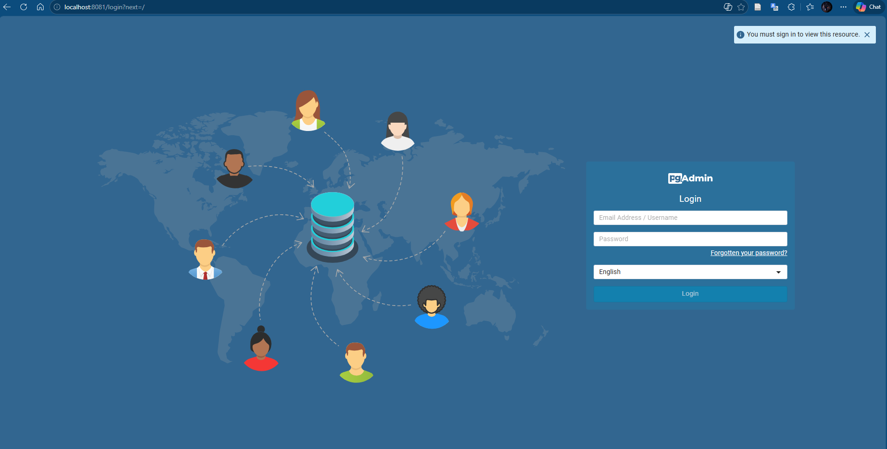
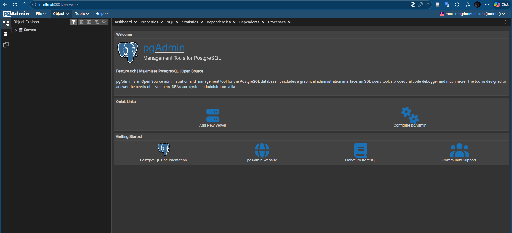
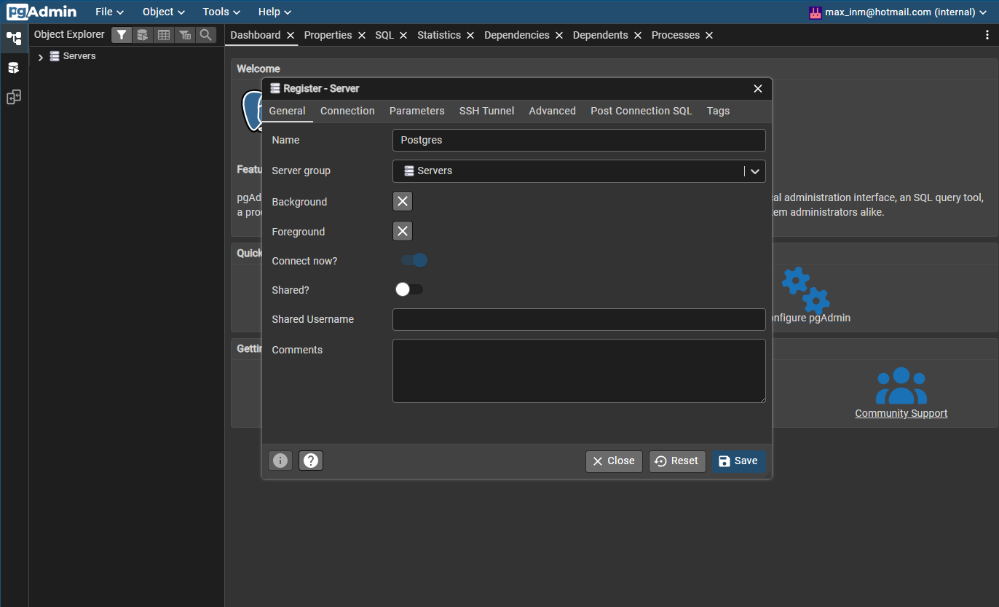
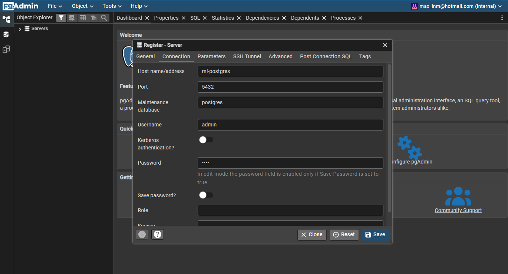
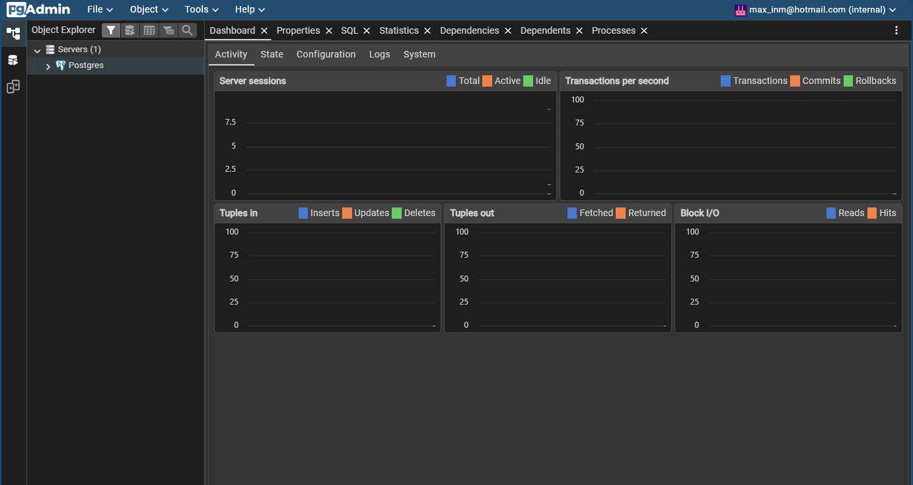
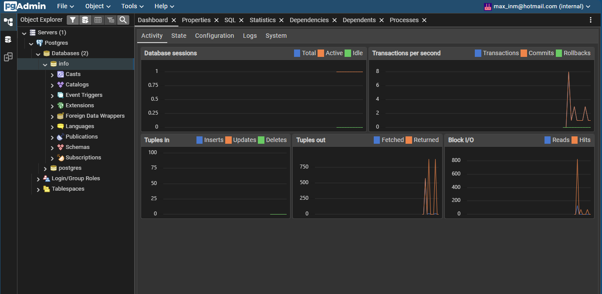
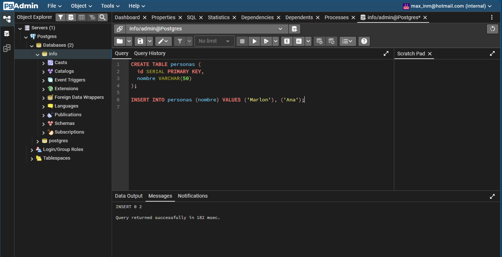
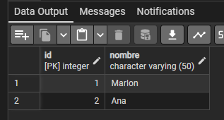

### Crear contenedor de Postgres sin que exponga los puertos. Usar la imagen: postgres:18-alpine3.22
# COMPLETAR

### Crear un cliente de postgres. Usar la imagen: dpage/pgadmin4

# COMPLETAR

La figura presenta el esquema creado en donde los puertos son:
- a: 8081 (puerto externo del host para acceder a pgAdmin)
- b: 80 (puerto interno de pgAdmin)
- c: 5432 (puerto interno de Postgres)

## Desde el cliente
### Acceder desde el cliente al servidor postgres creado.

# COMPLETAR CON UNA CAPTURA DEL LOGIN

### Crear la base de datos info, y dentro de esa base la tabla personas, con id (serial) y nombre (varchar), agregar un par de registros en la tabla, obligatorio incluir su nombre.
Debido a que ambos contenedores no se encuentran en la misma red, se dio un problema de coneccion entre los contenedores cuando se configuraba el nombre del host "mi-postgres" en pgadmin. Por lo tanto se creo una red que contiene a postgres (mi-postgres) y al contenedor de pgadmin (mi-pgadmin), dicha red se creo con el comando adjunto y de esta manera, se borraron los contenedores previos y se incluyo los contenedores en en la red "mi-red" con los siguientes comandos:
1. La red: docker network create mi-red
2. Contenedor postgres "mi-postgres" en la red "mi-red": docker run -d --name mi-postgres --network mi-red -e POSTGRES_USER=admin -e POSTGRES_PASSWORD=1234 -e POSTGRES_DB=info postgres:alpine3.22
3. Contenedor pgadmin "mi-pgadmin" en la red "mi-red": docker run -d --name mi-pgadmin --network mi-red -p 8081:80 -e PGADMIN_DEFAULT_EMAIL=max_inm@hotmail.com -e PGADMIN_DEFAULT_PASSWORD=admin dpage/pgadmin4:latest
Se establecio esta configuracion para el servidor:

Y para el host, usuario y pass:

## Desde el servidor postgresl
El servidor creado:

### Acceder al servidor
### Conectarse a la base de datos info
Coneccion a la bd "info":

# COMPLETAR
### Realizar un select *from personas

Creacion de la tabla e insercion de datos:

# AGREGAR UNA CAPTURA DE PANTALLA DEL RESULTADO
Ejecucion del comando select:
