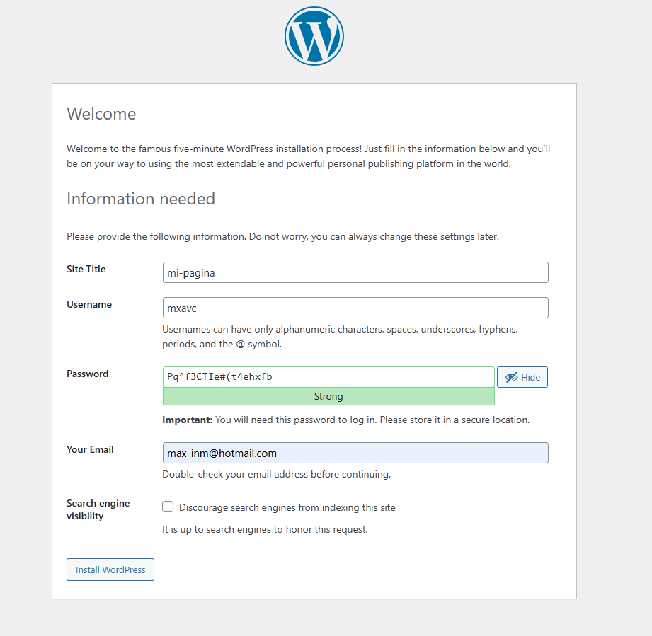
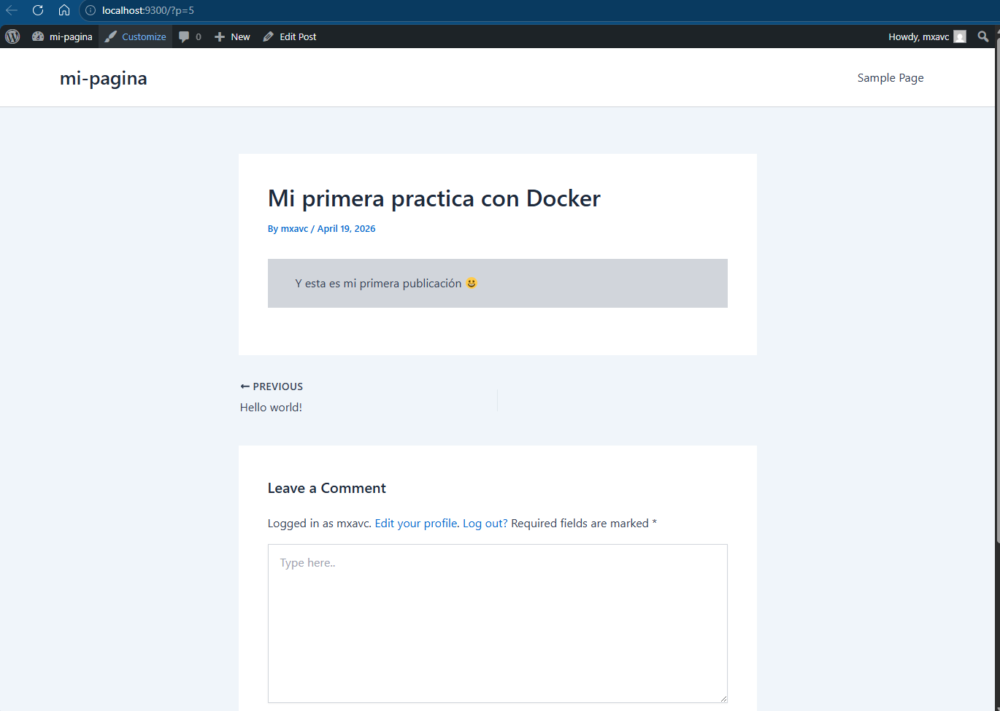

## Esquema para el ejercicio

### Crear la red
# COMPLETAR

### Crear el contenedor mysql a partir de la imagen mysql:8, configurar las variables de entorno necesarias
# COMPLETAR

### Crear el contenedor wordpress a partir de la imagen: wordpress, configurar las variables de entorno necesarias
# COMPLETAR

De acuerdo con el trabajo realizado, en el esquema del ejercicio el puerto a es **(completar con el valor)**

Ingresar desde el navegador al wordpress y finalizar la configuración de instalación.
# COLOCAR UNA CAPTURA DE LA CONFIGURACIÓN

Desde el panel de admin: cambiar el tema y crear una nueva publicación.
Ingresar a: http://localhost:9300/ 
recordar que a es el puerto que usó para el mapeo con wordpress
# COLOCAR UNA CAPTURA DEL SITO EN DONDE SEA VISIBLE LA PUBLICACIÓN.

### Eliminar el contenedor wordpress
# COMPLETAR

### Crear nuevamente el contenedor wordpress
Ingresar a: http://localhost:9300/ 
recordar que a es el puerto que usó para el mapeo con wordpress

### ¿Qué ha sucedido, qué puede observar?
WordPress conserva la configuración, el tema y las publicaciones.
Esto ocurre porque los datos no se guardan en el contenedor de WordPress, sino en la base de datos MySQL (mi-mysql).
Mientras el contenedor MySQL siga existiendo, toda la información del sitio se mantiene.
# COMPLETAR

